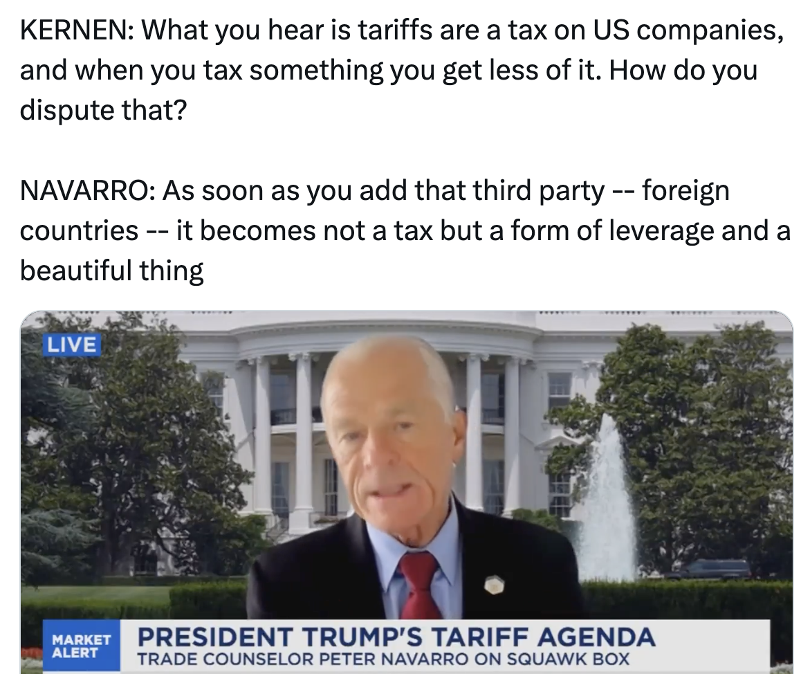
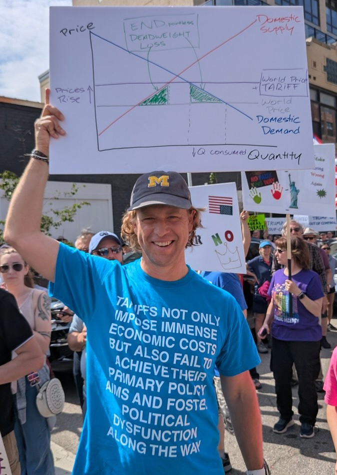
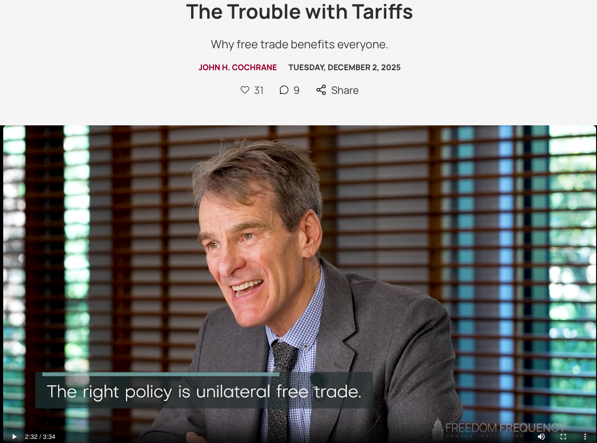
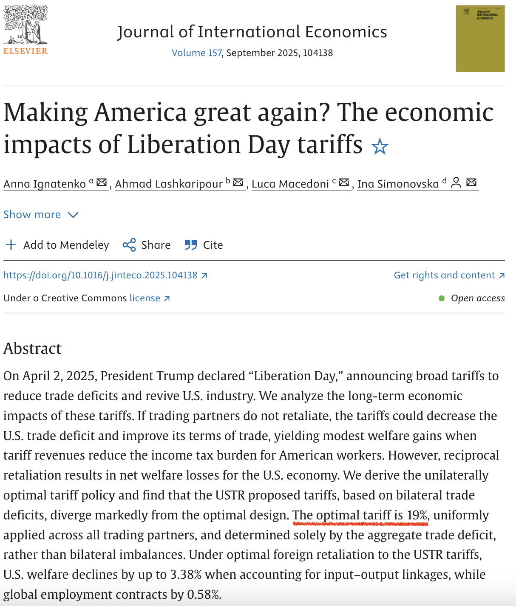
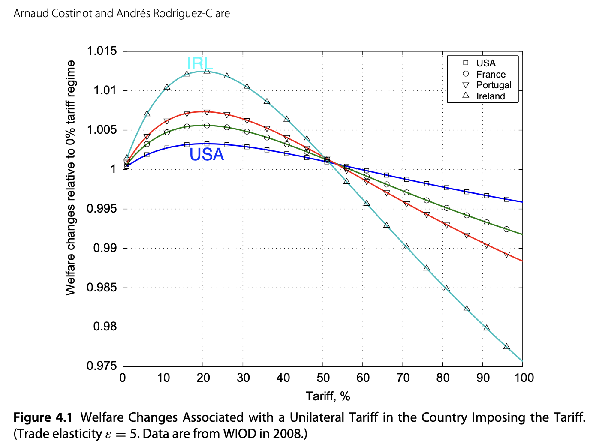

# TnT
Planned archive of quantitative trade models and the data needed to run them. 

Start with an implementation of an Eaton and Kortum (2002) model with tariffs and trade deficits.

# Are Quantitative Trade Models too MAGA?

## What MAGA tells the public about tariffs

## What economists tell the public about tariffs

>remember, there’s no point to the tariffs. The right policy as far as the economy is concerned is unilateral free trade.

>Let us, as they say, not put rocks in our ports. Something that impedes trade.

>And it doesn’t matter if trade is fair or balanced or if the other side does the same thing. If China puts in a tariff, i.e. puts rocks in their ports, why are we better off by putting rocks in our ports in exchange? The only thing that matters for trade is that it be mutually advantageous. We want to buy and they want to sell. That’s better for all of us.

[Cochrane's full post on tariffs](https://www.thefreedomfrequency.org/p/the-trouble-with-tariffs)

## What trade economists tell each other
### Oleg Itskhoki panel remarks
>Is it in the interest of the U.S. to have a 10% tariff on the rest of the world? With no retaliation, right? And so the optimal tariff argument suggests that probably, yes, I mean, given elasticities, probably a 10% tariff is a big financial win for the U.S., right? That if US can get away with it, without retaliation, we should actually advise **policymakers** to do that, right?

[Oleg Itskhoki remarks at 1:32 on NBER panel ](https://www.nber.org/research/videos/2025-international-trade-and-macroeconomics-panel-future-global-economy)

### Ignatenko, Lasharipour, Macedone, and Simonovska (JIE, 2025)

[Journal of International Economics, 2025](https://www.sciencedirect.com/science/article/pii/S0022199625000959)

### Costinot and Rodriguez-Clare Handbook chapter

- $\forall$ countries,  t* ≈ 1/ε ≈ 20%.
- Larger gains for small countries
- Accounting for intermediates **increases the gains** from a unilateral tariff.
- Ignatenko et al (2025) agree on the magnitude of optimal tariff for US, but they find 1.8% welfare gain (whereas CRC find less than 0.5%)

